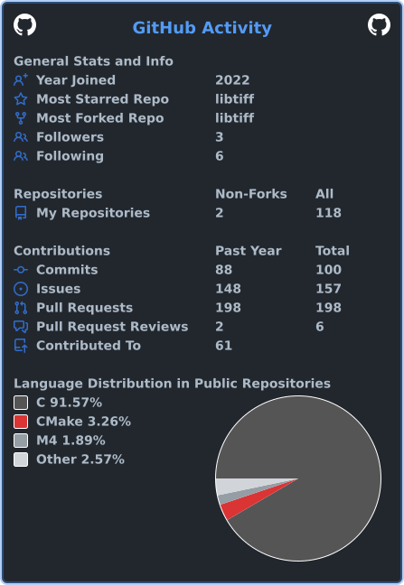

# Carlos

`RISC-V` · `Systems Software` · `Open Source`

Building, debugging and upstreaming low-level software.

## Current focus

- RISC-V, emulation and systems software
- C/C++/Rust, performance and low-level debugging
- Reproducible bugs, code review and upstream fixes

## Selected work

- [sbllm-riscv](https://github.com/carlosqwqqwq/sbllm-riscv) — Personal RISC-V project
- [HexRaysSA/rax](https://github.com/HexRaysSA/rax) — Recent upstream systems work
- [libriscv/libriscv](https://github.com/libriscv/libriscv) — Fast RISC-V sandbox
- [LekKit/RVVM](https://github.com/LekKit/RVVM) — RISC-V virtual machine
- [unicorn-engine/unicorn](https://github.com/unicorn-engine/unicorn) — Multi-architecture CPU emulator

## Toolset

`C` `C++` `Rust` `Python` `Linux` `Git` `RISC-V`

## GitHub activity

  

## Contribution map

  

  

## Collaboration

Issues, pull requests and discussions in the relevant repository are the best
way to collaborate. Minimal reproducers and expected behavior make debugging
faster.

  <a href="https://github.com/lebedevnet/ReadmeForge">README layout: ReadmeForge</a>
  ·
  <a href="https://github.com/cicirello/user-statistician">Stats: user-statistician</a>
  ·
  <a href="https://github.com/yoshi389111/github-profile-3d-contrib">3D: github-profile-3d-contrib</a>

