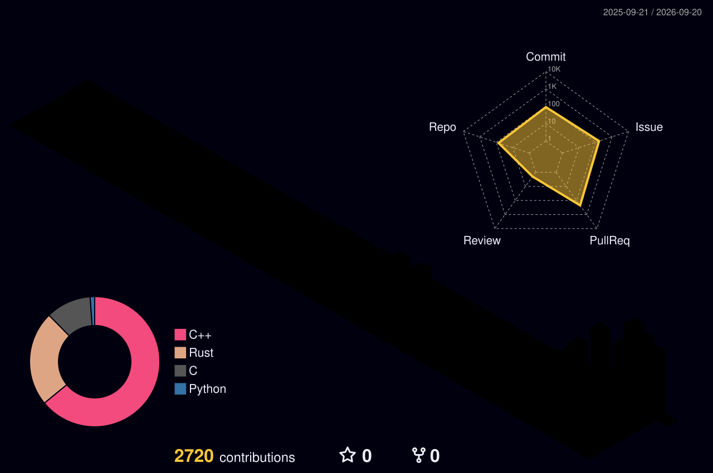

## Activity

These static cards are generated inside this repository from public GitHub data.

<table>
  <tr>
    <td width="50%" valign="top">
      
    </td>
    <td width="50%" valign="top">
      
    </td>
  </tr>
</table>

Top languages describes the language distribution of public repository code; it is not a skill ranking.

## Contribution map

  

  <picture>
    <source media="(prefers-color-scheme: dark)" srcset="./images/github-contribution-grid-snake-dark.svg"/>
    <source media="(prefers-color-scheme: light)" srcset="./images/github-contribution-grid-snake.svg"/>
    
  </picture>

## Open source

If you are working on RISC-V, emulation or systems software, start with a minimal reproducer, expected behavior and environment details. That gives an issue or pull request a clear path to a useful fix.

  <a href="https://github.com/carlosqwqqwq?tab=repositories">Browse public work</a>
  |
  <a href="https://github.com/carlosqwqqwq?tab=activity">See recent activity</a>

  <a href="https://github.com/stats-organization/github-readme-stats-action">GitHub stats</a>
  |
  <a href="https://github.com/yoshi389111/github-profile-3d-contrib">3D contributions</a>
  |
  <a href="https://github.com/Platane/snk">Contribution map</a>

